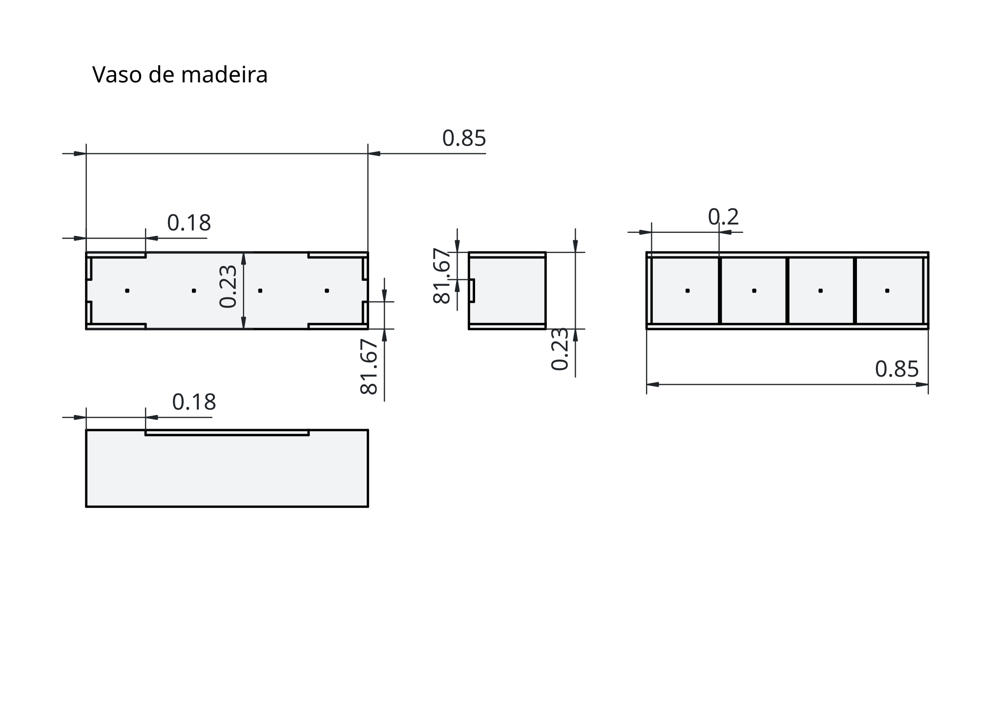

## Plantação vertical para pequenas hortaliças

O objetivo desse projeto é criar uma hortaliça com sensores 
acoplados para monitorar indicadores de crescimento e 
qualidade, para fins de aprendizado.

Com esse projeto, eu tenho o objetivo de aprender:
- Marcenaria 
- Jardinagem
- IOT
- Engenharia de Dados
- Ciência de Dados
- Gestão de Projetos

A restrição que eu tenho é minimizar o gasto e 
maximizar aprendizado (priorizando dados).

## O projeto

Meu desejo é ter um vaso de madeira retangular com 4 compatimentos 
para plantas diferentes.

A ideia do projeto é criar três estruturas:
- O vaso para 4 hortas
- A caixa de água
- E a central de controle (onde ficará o IOT)

## Lista de compras

Para o hardware:
- ESP32 (~R$60,00)
- ESP32-CAM (~R$70,00)
- Um sensor capacitivo de umidade do solo (~R$80,00)
- Um sensor AHT20 (~R$30,00)
- Um Bombinhas 5V Mini (R$35,00)
- Fonte USB 5V (R$30,00)
- Módulo relé (R$20,00)
- Cabos jumper (possuo)
- Protoboard ou placa perfurada (possuo)
- Resistores (possuo)
- lone de plástico (R$20,00)
- Uma caixinha (R$40,00)

Para o vaso:
- 5 placas de madeira de Pinus (R$100,00)
- Cola de madeira (possuo)
- Verniz marítimo (R$50)

Para a caixa de água:
- Um reservatório de plástico genérico (R$40,00)
- Mangueiras de 5mm de silicone [especificar metros] (R$20,00)
- Conexões (R$20,00)

Substrato:
- Terra (R$30,00)
- Húmus de minhoca (R$30,00)
- Sementes (possuo)

---

## Vaso

A modelagem foi feita com o Blender 5.1.2 e o desenho das 
especificações técnicas com o FreeCAD 1.1.1.

### Dimensões

Dimensões:
- comprimento: 20cm (útil) + 3cm (vãos para 2 tábuas de 15mm)
- largura: 80cm (útil) + 3cm (vãos para 2 tábuas de 15mm) + 1.5cm (vãos para 3 tábuas de 5mm)
- altura: 20cm (útil) + 1.5cm (sobra superior) + 1.5cm (encaixe para base de 15mm) 

Interno: 
20cm x 20cm x 20cm para cada compartimento.

Total:
23cm x 84.5cm x 23cm.

[Esqueci da base para a caixa de água de acrílico]
